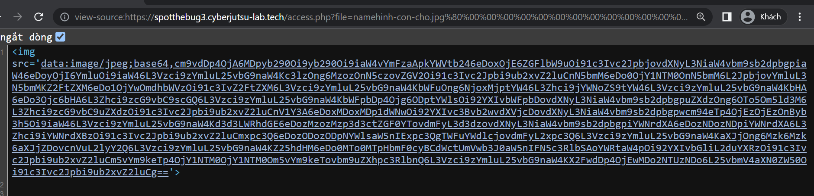

## Hash Length Extension Attack 

### Nếu mọi người chưa biết rõ về lỗi này thì nên xem video của CyberJutsu nhé, rất hay và chi tiết.
https://www.youtube.com/watch?v=9yOKVqayixM&t=888s&ab_channel=CyberJutsuTV (part 1)

https://www.youtube.com/watch?v=GnCTXf_avdo&t=506s&ab_channel=CyberJutsuTV (part 2)

Mình vào coi xong video thì vào trang web: https://hash-playground.cyberjutsu-lab.tech/ này để tạo payload nhưng ko còn vào được nữa =))

Và như trong video thì phần này chưa có hỗ trợ tính năng brute-force cho chiều dài của secretKey nên mình code lại luôn.

Script mình để ở đây: [exploit.py](https://github.com/d47sec/CTF-Writeups/tree/main/CBJS/HashLengthExtensionAttack/exploit.py)

Nếu chúng ta đọc file không phải là file ảnh, ví dụ như file /etc/passwd thì ta cần view-source(Ctrl + U) sau đó đem giá trị này đi base64 decode để đọc nội dung file.

