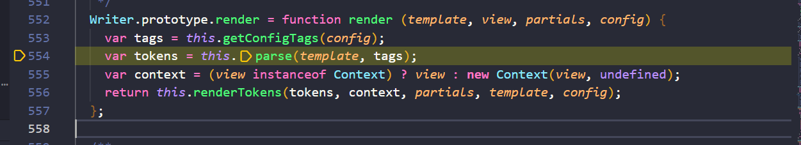
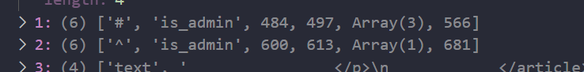

### Panda Memo 

Đây là 1 bài prototype pollution khá hay :))
Source code ở đây.

[Source code](panda_memo.zip)

Ứng dụng sài template engine là mustache 

Để có flag thì phải access vào `/admin` và phải thoả điều kiện là isAdmin(req)

Tóm lại bài này cần exploit prototype pollution 2 chỗ
1. ở hàm console.table() nó có cve về lỗi prototype pollution , nó sẽ làm pollution Object.prototype[0]='' , cái này sẽ bypass được điều kiện check là khác undefined 

https://hackerone.com/reports/1431042

2. prototype pollution ở lib, cụ thể ở đây chính là cái thằng template engine mustache. Vì trong source code ko có taint nào có thể pollute được nên phải đi vào thư viện để xem

Đây là file admin.html, khi ta access vào endpoint admin, nếu là admin nó sẽ trả về flag, còn ko nó sẽ báo access denied 

Khi access vào endpoint /admin nó sẽ gọi đến hàm mustache.render() 
, biến content chính là nội dung của file admin.html 

Sau đó nó sẽ kiểm tra xem type của nó có phải là string hay ko, nếu ko nó sẽ báo lỗi template invalid

Còn hợp lệ thì nó sẽ nhảy đến hàm defaultWriter.render()

tham số template chính là nội dung của file admin.html 

Sau đó nó sẽ nhảy đến hàm parse() để đi parse cái template được truyền vào 

Sau đó nó sẽ thực hiện cộng chuỗi với biến template với chuỗi `:{{}}:` và lưu vào biến cacheKey , kiểu nó là định dạng  chung cho những cái key của thằng template này 

Ở đây biến isCacheEnabled=true, nên nó sẽ nhảy đến hàm cache.get(cacheKey), cái cacheKey chính là cái nội dung của file admin.html + `:{{}}:` 

Nếu ở đây, ta pollute vào giá trị biến cacheKey này thành 1 cái tempalte mà ta mong muốn, thì có phải là ta control được cái nội dung sẽ được server render đúng ko ?

Sau khi cache.get(cacheKey) thực hiện xong, nó sẽ trả về cho chúng ta biến tokens, nó là một Array .
Vì ta sẽ pollute cái giá trị trả về nên cần cung cấp đúng syntax của nó 

Phần tokens mình sẽ sửa lại là dù có phải là admin hay ko thì cũng sẽ trả về FLAG

refs: https://github.com/theoremoon/cakectf2022-public/blob/master/web/panda_memo/solution/solve.py