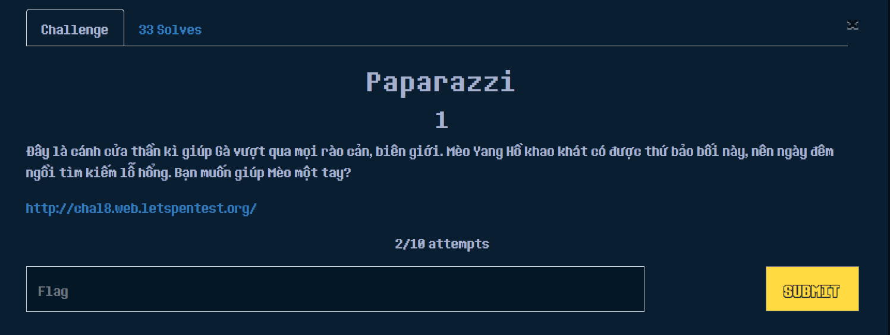
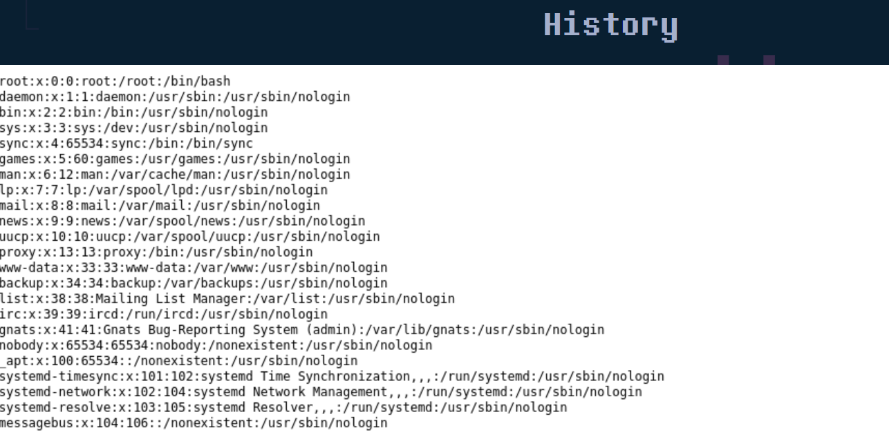
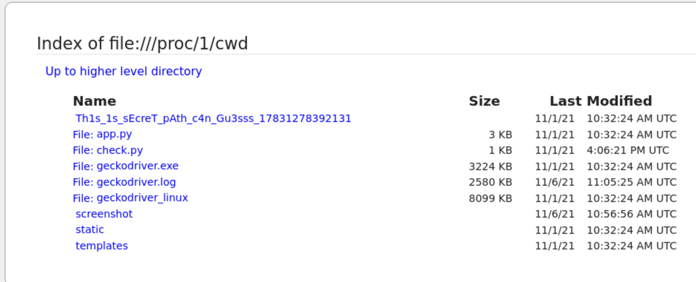

# WEB-EXPLOIT
## 1. PAPARAZI

Bài này sẽ nhận vào input là một **URL** từ chúng ta và sau đó sẽ gửi request đến URL này sau đó screenshoot cái **URL** , nghe qua là có mùi dính lỗi ***SSRF*** rồi.
Oke mình thử nhập vào input như sau: ***file:///etc/passwd*** thì nó sẽ trả về như sau:
> {"status":"62d8c8ec67414c029bb3673beafe04fb.png"}

Hmmm có vẻ nó đã gửi request thành công , về lại trang chủ phía dưới **HISTORY** mình thấy nội dung của file /etc/passwd đã xuất hiện ở đây.

Okie vậy có thể khẳng định là nó bị ***SSRF*** rồi ha. Giờ tìm file flag nằm ở đâu nữa là xong.

Sau một hồi fuzzing các thư mục thì mình thử ***file:///proc/1/cwd*** thì xuất hiện 1 thư mục lạ :))
> Thư mục proc là một thư mục đặc biệt, nó thuộc loại virtual filesystem (nôm na là hệ thống file ảo) nó thường lưu thông tin về các tiến trình đang chạy trên hệ thống,
1 ở đây là PID của process đang chạy trên hệ thống, mỗi process sẽ có 1 PID khác nhau, còn cwd là một sym link đến thư mục của tiến trình đang chạy ở đây là tiến trình 
có PIP 1. Đọc thêm về [thư mục proc](https://tldp.org/LDP/Linux-Filesystem-Hierarchy/html/proc.html)
và symlink ở đây(symlink)[https://www.freecodecamp.org/news/symlink-tutorial-in-linux-how-to-create-and-remove-a-symbolic-link/]

Tiếp tục vào thư mục này xem có gì thì thấy có file flag.txt ở đây => Đọc flag nữa là xong 

FULL PAYLOAD: ***file:///proc/1/cwd/Th1s_1s_sEcreT_pAth_c4n_Gu3sss_17831278392131/flag.txt***

> FLAG{abc725173fa1828ea019503669b4eecd}

