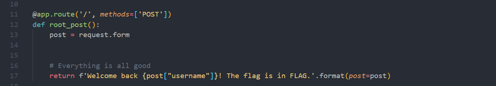
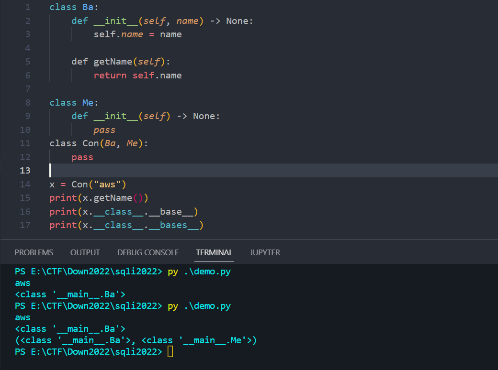
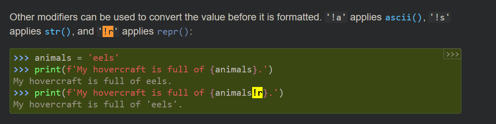

# PHÂN TÍCH 
Bài này cho source code khá ngắn ... Sau khi nhìn qua Dockerfile thì ta thấy flag nằm ở biến môi trường 

Bài này cho 1 cái form để login username, password

Khi nhìn qua source code thì mình thấy 1 vài chỗ rất khả nghi 

2 giá trị username, password ta có thể control được vậy liệu có cách nào sqli ở đây ko ???


Sau đó sẽ kiểm tra câu truy vấn có trả về data ko


Và dòng này, khi mình thấy dòng này mình nghĩ ngay tới cái bug format string trong python , và lợi dụng bug này ta có thể đọc được các thông tin trong biến môi trường. Rất hợp lí với bài này 


### PART1 - FORMAT STRING VULN 

Để kiếm chứng thì mình xoá hết phần code ở trên, để thử khai thác lỗi format string có được ko 
https://podalirius.net/en/articles/python-format-string-vulnerabilities/




Ở đoạn code trên ta có 1 biến post kiểu string , ta sẽ lợi dụng biến này để thực hiện gọi đến các thuộc tính của string 
`username={post.\_\_init\_\_.\_\_globals\_\_[os].environ[FLAG]}`
Payload này có chức năng sẽ lấy giá trị của biến FLAG ra 


Và ta thấy là đã đọc được flag

Giải thích về payload như sau. Vì mọi thứ trong python đều là Object, mà Object thì sẽ có các thuộc tính và các phương thức , trong Python cũng vậy. 


Hàm dir() có chức năng hiển thị ra hết các thuộc tính , phương thức của 1 đối tượng 
Các magic methods trong python 
- \_\_class\_\_: trả về tên class của đối tượng đó


- \_\_init\_\_: khởi tạo một instance của class 

- \_\_base\_\_: trả về class cha trực tiếp của class đó, \_\_bases\_\_ trả về tất cả class cha trực tiếp của class đó  dưới dạng tuple 




- \_\_mro\_\_: trả về thứ tự của các class được gọi, khi nó tìm kiếm một thuộc tính/phương thức nào đó 


- \_\_subclases\_\_(): trả về tất cả các class con của class hiện tại 


- \_\_builtins\_\_: dùng để truy cập trực tiếp đến các constants/functions(gì gì đó) mà có sẵn. Vd như builtins.open


Gọi đến hàm eval() để thực thi code python => thường được sử dụng để RCE 


- \_\_globals\_\_: trả về 1 dictionary chứa tất cả các biến toàn cục trong chương trình 


- \_\_import\_\_(): được sử dụng để load các class và các functions 

Vậy tóm lại phần 1 này là ta đã hiểu là bài này cần khai thác lỗi format string để lấy được giá trị biến môi trường.

### PART2 - SQLI
Oke giờ ta quay lại đoạn code ban đầu đọc tiếp và phân tích chỗ sql liệu có sqli đc ko 


Ở đây ta thấy có !r khá lạ, đi google thì nó là 1 kiểu format string trong python (format string literals python)
https://docs.python.org/3/tutorial/inputoutput.html#formatted-string-literals



Ta thấy khi sử dụng !r thì chuỗi của ta sẽ được đóng trong cặp dấu nháy đơn 'anything'
https://docs.python.org/3/library/functions.html#repr

Giờ ta sẽ đi test các trường hợp ngách để xem thằng !r nó xử lí như nào, và sẽ tìm cách lợi dụng để khai thác lỗi SQLI 

Sẽ dựng lại source code để debug xem các hành vi lạ của 

Khi ta cung cấp chuỗi `name="d47'\""` => thì thằng !r nó sẽ trả về chuỗi `'d\'"47'` => và lúc này lệnh print chạy bình thường vì nó là chuỗi bình thường


Nhưng ...


Trong sqlite nó lại ko hiểu như vậy ... 
Nó báo lỗi này có nghĩa là nó ko hiểu phần `"in' AND password = 'password'"`

Mình thử thêm comment trước chữ `in` nhưng vẫn báo lỗi, ta thấy nó vẫn còn mắc chuỗi "


Giờ sẽ thay đổi vị trí của chuỗi ' và " 


Vẫn lỗi, nhưng h ta thêm comment vào lại trước chữ in 


Ta đã chạy được câu truy vấn :> => SQLI thành công 

Nguyên nhân tại sao 


Đó là do : `\'` thì mysql sẽ hiểu đó là dấu ' 

Còn đối với sqlite: nó hiểu là: `\'` => cái dấu \ là 1 chuỗi còn dấu ' sẽ là escaped tring 


Nên chuỗi xxxxx phía sau sẽ khiến câu truy vấn bị lỗi 

Kết luận ta sqli được do conflict của 2 thằng đó chính là python và sqlite 

=> Sau 2 phần thì ta đã có được 2 bug là format string và sqli 

H đem bug sqli đi xiên thử xem như nào 

Payload: username=adm\"'union select 1,2-- -in&password=asd 


Ta đã sqli thành công nhưng ... 

```
if username != post["username"] or password != post["password"]:
        return 'Wrong credentials (are we being hacked?)'
```

Đoạn check này nó sẽ kiểm tra liệu username,password của ta nhập vào có giống với cái output của câu truy vấn ko, và tất nhiên là ko rồi =))


Giờ ta cần tìm cách nào đó để cho cái input và output khi đi qua câu truy vấn sẽ giống nhau 

=> SQL QUINE (quine trong computer science có nghĩa 1 ct ko nhận input , nhưng nó tạo một bản sao để output giống với cái source code) nghe hơi khó hiểu :))

Bây giờ ta sẽ tóm lại ta sẽ gửi payload như sau.
username={post.\_\_init\_\_.\_\_globals\_\_[os].environ[FLAG]}"'&password=union+select+XXX,YYY-- -

Giờ cái XXX khá dễ nó cũng sẽ là cái chuỗi: {post.\_\_init\_\_.\_\_globals\_\_[os].environ[FLAG]}"'
Nhưng cái YYY, làm sau cho nó bằng chuỗi: union+select+XXX,YYY-- -

[Script exploit](exploit.py)

Refs:
https://hackmd.io/@hoifanrd/SkIY868tD
https://chowdera.com/images/2022/200/images/202207190126313672.html
https://www.shysecurity.com/post/20140705-SQLi-Quine
https://www.justinsteven.com/posts/images/2022/09/27/ductf-sqliimages/2022/
http://www.hackdig.com/06/hack-677892.htm

