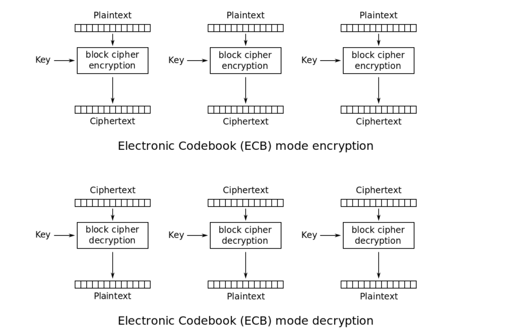

# ENCRYPTBOIZZZ (Author: nhienit)

SOURCE CODE BÀI NÀY MÌNH ĐỂ Ở TRÊN, CÓ DOCKER NÊN CÁC BẠN CÓ THỂ DELOY LẠI TRÊN LOCAL

```
B1: sài lệnh git clone để clone cái repo này
B2: sau đó cd vào thư mục vừa clone về
B3: docker-compose up -d
B4: sau đó truy cập vào URL như sau: http://localhost:2010
```

# PHÂN TÍCH


Ta có thể thấy bài lấy vào 4 tham số là `file`, `name`, `command`, `auth_key`

Ta thấy tham số `auth_key` nếu như giá trị này bằng với biến `$auth_key` trong file `config.php` là có thể thực thi `command` ở lệnh `system()`

Nhưng mà biến `$auth_key` lại được dấu trong file `config.php` rồi.

Ta phân tích tiếp chỗ tham số `name`, giá trị của này sẽ được đưa vào hàm `encrypt()` sau đó lưu vào `$_SESSION['name']` , 
ta có thể đọc được file này thông qua tham số `file` với path là `/tmp/sess_PHPSESSID`

Ở tham số file , nó sử dụng hàm `readfile` để đọc file, nhưng mình thử đọc file `config.php` thì không được, mà được thì dễ quá =)), nên tác giả khả năng cao là sẽ `filter` không cho đọc file `php`

Bây giờ ta phân tích hàm `encrypt()` ở trên 


Ta thấy ở đây nó sử dụng mã hoá là `AES MODE ECB` và mode này là mode yếu nhất trong AES và ta có thể attack dạng AES ở mode này.

Ta thấy size của mỗi block là 16 bytes, và input của hàm `encrypt()` là giá trị mà ta nhập vào ở tham số `name` + biến `$auth_key` ở trong file `config.php`

Còn hàm `pad()` thì nó chỉ đơn giản nếu như input của chúng ta gửi vào mà chiều dài ko chia hết cho 16 thì nó sẽ tự động padding thêm vài bytes để đủ 16 bytes. Còn nếu chia hết thì thôi.


# KHAI THÁC

Để giải bài này thì ta cần hiểu rõ về cách `AES MODE ECB` nó hoạt động như nào ?



Đây là cơ chế mã hoá và giải mã của nó. Nó chia input thành từng khối 16 bytes và sau đó encrypt từng khối riêng biệt với nhau nếu block cuối cùng ko đủ 16 bytes nó sẽ tự động padding vào cho đủ.

Các bạn có thể đọc thêm để hiểu rõ cách attack của dạng này như nào ở [đây](https://zachgrace.com/posts/attacking-ecb/)

Vậy giờ mình sẽ lợi dụng việc này để brute cái `$auth_key` trong file `config.php`

Script exploit của mình để lấy `auth_key` ở [đây](solve.py)

`auth_key` mình lấy được thì thiếu 1 chữ =)), nhưng mà nhìn vậy mình cx đoán được đó là chữ r or R =))

`auth_key` sẽ là **AuthKey4N00b3r**

Có `auth_key` thì việc lấy flag khá dễ.


Lấy flag nữa là xong game :))

Ở đây ta ko thể sài `command` để đọc flag vì giới hạn chỉ có 5 kí tự, nhưng hãy nhớ ban đầu ta có tham số `file` cho ta đọc file


> FLAG: KCSC{Hello hacker! Hello new member ! Hello our talent <3}


