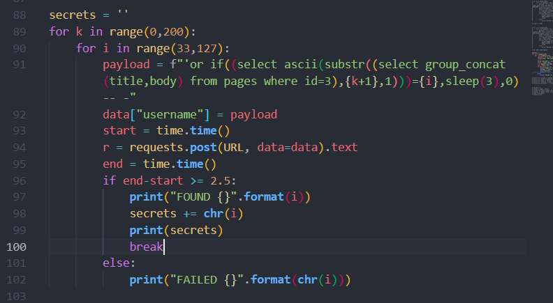

Bài cho một vài endpoint như /e3bdb455e9/page/1 test xem thử có dính lỗi IDOR ở trang web này không thì thử thay đổi 1 thành 2 thì có, nhưng thay thành 3 thì access denied, sau đó là có chức năng tạo page nhưng cần phải có acccount và trang cho 1 form login

Sau 1 hồi test thì phát hiện bài dính lỗi BLIND SQLI (Mysql) ở field username 

Script solve trong file exploit.py

Flag 1: 

^FLAG^5d7c9221147b8f4fbea4db223077c79e40e28da377753a60109d5e8ece234241$FLAG$

Flag 2:

Sài burpsuite để gửi request đến /e3bdb455e9/page/1 cùng với username, password ở phần body sẽ có Flag 2

Sau khi truy cập vào ENDPOINT /e3bdb455e9/page/3 thì đều trả về 403

Sau một hồi loay hoay, tìm cách bypass thì no hope, nhớ lại là lúc brute table thì có 2 tables , 1 cái là pages và admins, vậy h đọc data ở trong pages table chắc chắn flag ở trong đó or không :v

SỬA CODE LẠI NHƯ SAU

Flag 3: 

^FLAG^47847e60399a9dabfaec92be9a778ef48af513f181ca0a7720da230bb7e37688$FLAG$