## Endpoint ?page=shop 
sqli ở param type 

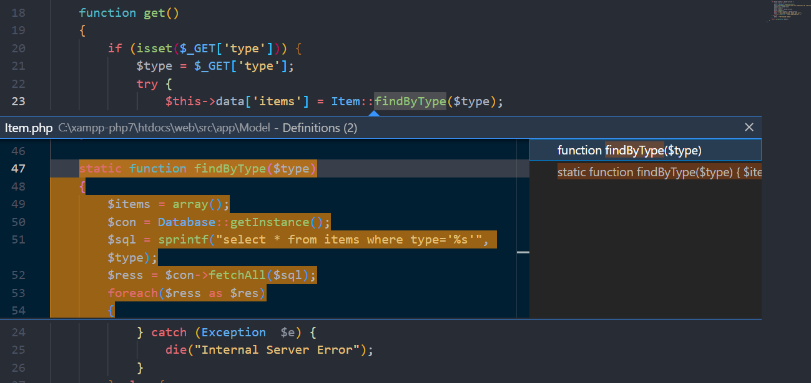

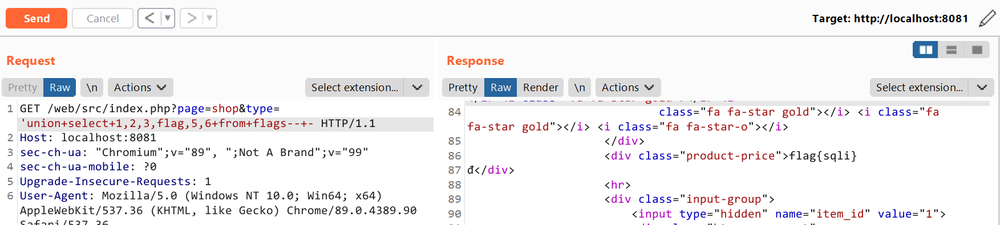

Từ đây là có thể đọc được flag ở trong table flags

## Endpoint ?page=user

Nếu có role=admin => thì nó sẽ gọi hàm preview 

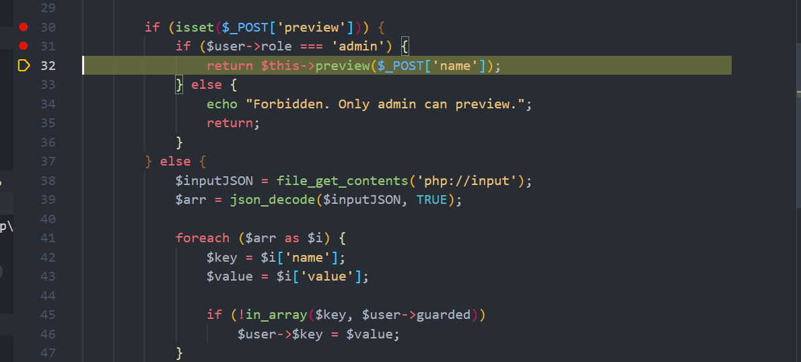

Gọi đến hàm view

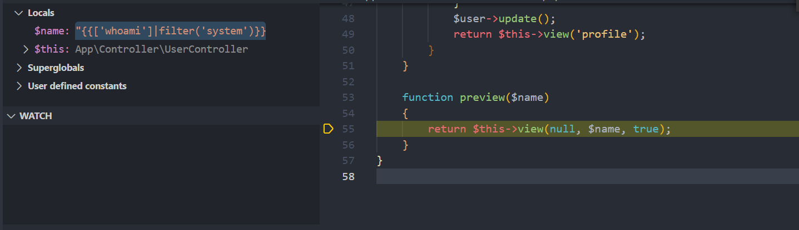
Sau đó gọi hàm preview_render() => nó sẽ load cái thư viện twig lên

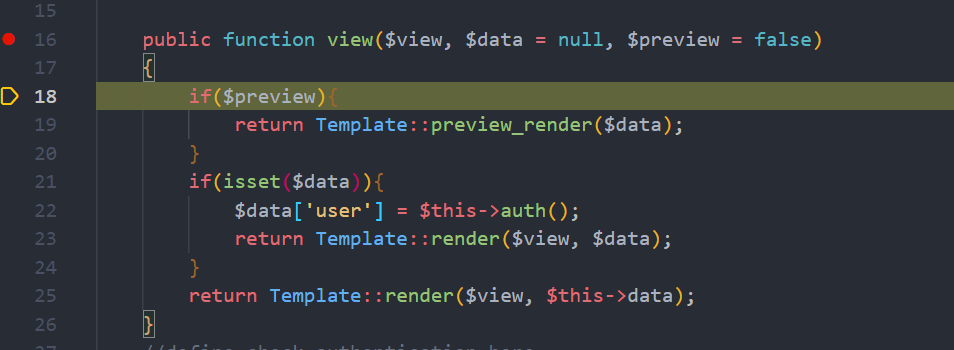

Và hàm preview_render() này dính bug SSTI => thông qua tham số name => cái này ta hoàn toàn kiểm soát được 
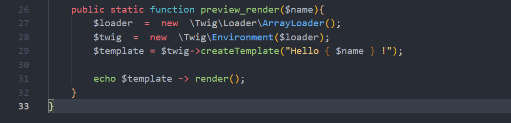

RCE
payload: {{['whoami']|filter('system')}} 

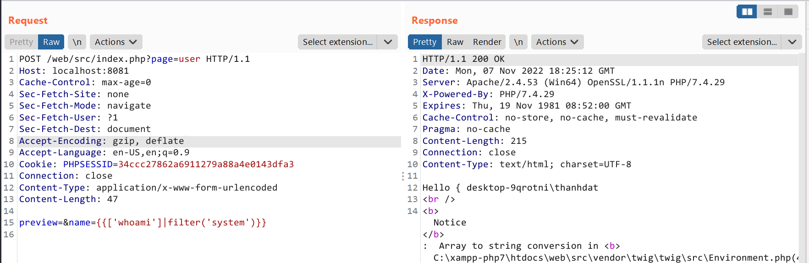

Nhưng mà viễn cảnh này RCE chỉ diễn ra khi ta có role là admin :)) và rõ ràng là hiện tại ko có role là admin, default sẽ là user 

Vậy ta cần 1 bug nào đó để lợi dụng admin gửi POST request => CSRF, SSRF blalla .. hoặc ko có :))

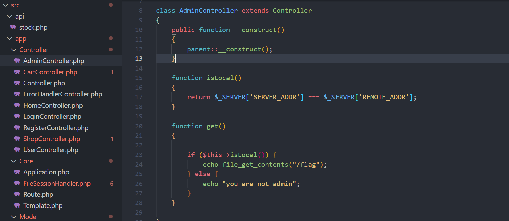

Chỗ này có vẻ khả nghi nếu ta truy cập đến endpoint này từ local => đọc được /flag => có vẻ ssrf ở đây 

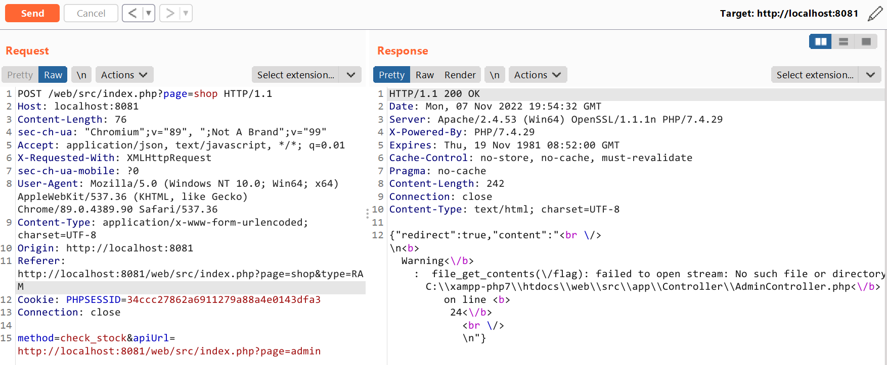

Ở đây mình ko biết giá trị của biến môi trường HOST_URL là gì nên đặt tạm =)))

Và với bug này thì ta có thể đọc được source code của đội khác => có được các thông tin liên quan TEAMSECRET,SALT,IV 

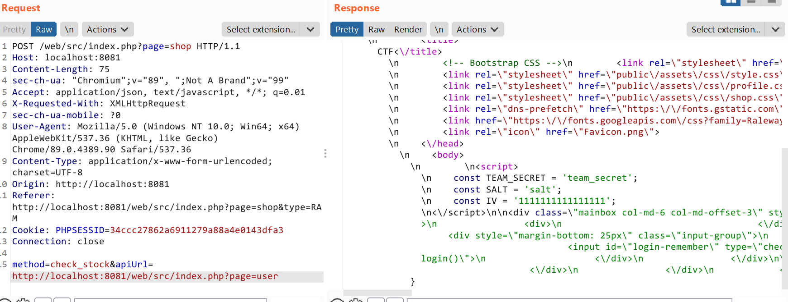

Nếu ta ko phải role admin thì sẽ nhảy vào nhánh if bên dưới 

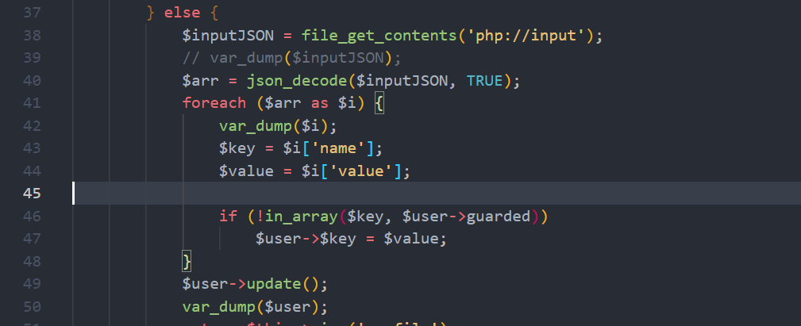

Đoạn code này cho ta update, các giá trị thuộc tính của users 

Ý định của mình sẽ update role=admin và kết hợp bug ssti là thành RCE 

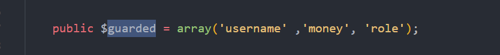

Nhưng ở đây nó sẽ ko cho update role :))

Vậy update cái khác thì sau ... 

Ở đây mình update luôn cái biến $guared, để mình có thể update role thành admin 

Đây là object user lúc ban đầu và lúc này role=user và guared=["role","username","money"] nên sẽ ko update đc role=admin ... 

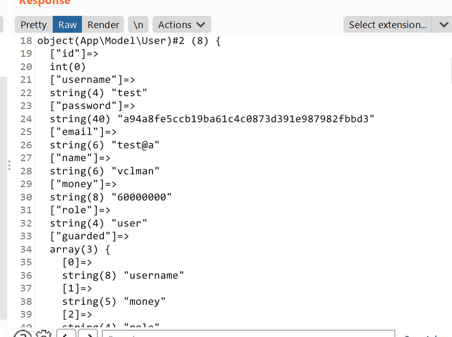

Giờ mình sẽ update biến guared 
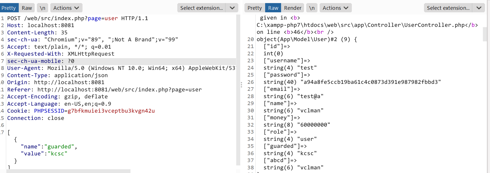

Đã update thành công :v , việc còn lại là khá dễ update role=admin thoi 

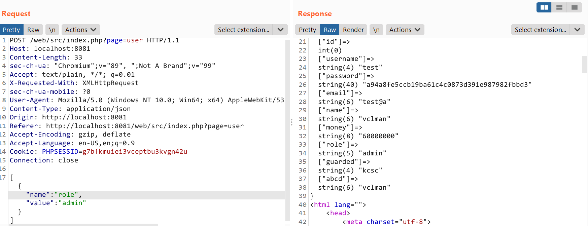

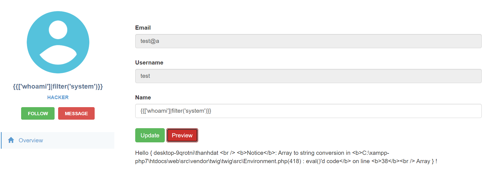

Pwned :v