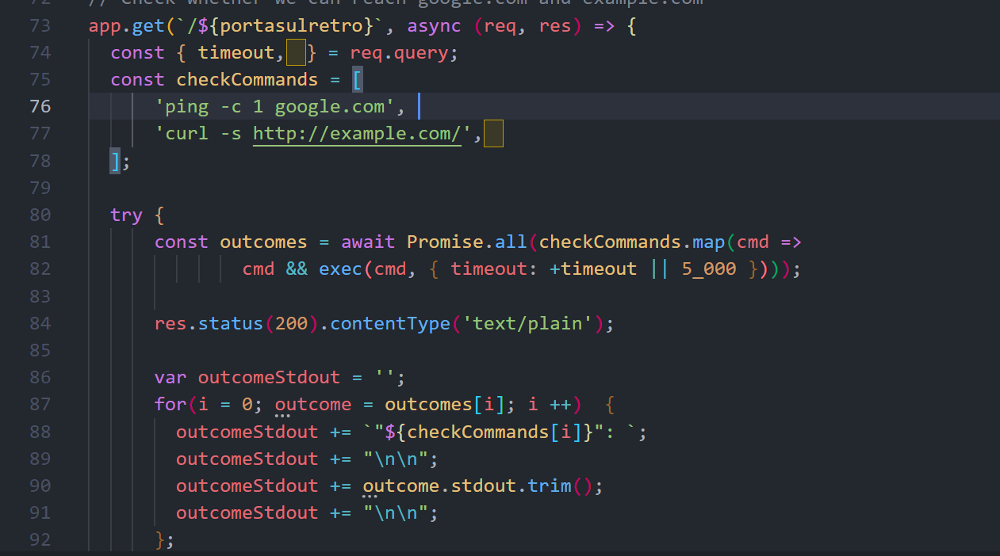
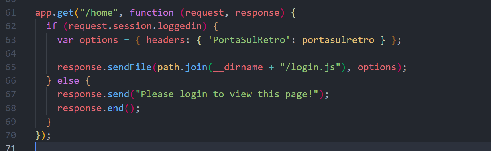
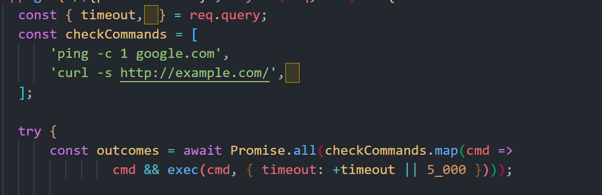

### SOLUTION

bypass login sử dụng username=admin&password[password]=1 

sau khi login thì có được source code của chall  

ta thấy đường dẫn của route này được gán với biến `${portasulretro}`

khi ta khi request đến route `/home` thì giá trị `${portasulretro}` sẽ được trả về trong header của response

ta thấy ở route `${portasulretro}` ta có thể thêm 1 param là kí tự hidden , và giá trị này sẽ được vào hàm `exec` mà không có filter gì => RCE 

